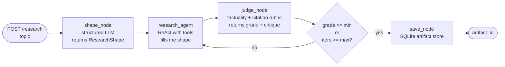

# agent_api — Week 3 Segment 4

A small FastAPI service that runs a four-node **agentic workflow** behind a
proper deployment skin: liveness + readiness probes, Prometheus metrics,
structured JSON logs with per-request IDs, a Dockerfile + compose, and a
matching FastMCP wrapper so the workflow plugs straight into the
[Forge](../forge/README.md) coding agent.

## What "agents in the loop" looks like here



- **`shape_node`** — a structured-output LLM picks the *shape* of the artifact
  (title, sections, target depth, whether citations are mandatory) before any
  research happens. The downstream agent doesn't have to invent a structure on
  the fly.
- **`research_node`** — a `build_solo` agent from
  [`src/multi_agent/topologies.py`](../../src/multi_agent/topologies.py) with a
  pair of stubbed `web_search` / `fetch_url` tools backed by a small in-memory
  teaching corpus. Fills the shape and emits inline citations.
- **`judge_node`** — a tailored rubric LLM that grades facts and citations,
  returns a 1-5 score plus a structured critique. Designed to flag fabricated
  URLs and uncited claims.
- **Loop** — if the judge's grade is below `min_grade` and we haven't hit
  `max_iterations`, the critique is appended to the research agent's next
  input. The retry is grounded in the judge's complaints, not just a re-roll.
- **`save_node`** — writes the final artifact and the full provenance trail
  (every iteration's grade + critique) to a local SQLite store. Subsequent
  callers retrieve it via `GET /artifacts/{id}`.

## Endpoints

| method | path | purpose |
|---|---|---|
| `GET`  | `/healthz` | liveness — 200 if the process is up |
| `GET`  | `/readyz` | readiness — 503 unless DB is writable and `OPENROUTER_API_KEY` resolves a model |
| `POST` | `/research` | run the workflow synchronously; body: `{topic, min_grade?, max_iterations?}` |
| `GET`  | `/artifacts/{id}` | fetch a saved artifact + full provenance |
| `GET`  | `/artifacts` | paginated list (`?limit=&offset=`) |
| `GET`  | `/metrics` | Prometheus exposition format |
| `GET`  | `/trace?request_id=...` | tail the structured log filtered to one request |

## Running

### Local, with uvicorn

```bash
cd apps/agent_api
python -m venv .venv && source .venv/bin/activate
pip install -r requirements.txt
cp .env.example .env  # then fill in OPENROUTER_API_KEY
# the workflow imports `from shared ...` so we need the repo's src/ on the path
PYTHONPATH=../../src uvicorn app.main:app --host 0.0.0.0 --port 8090 --reload
```

### Docker compose

```bash
cd apps/agent_api
cp .env.example .env  # fill in OPENROUTER_API_KEY
docker compose up --build
# /readyz flips green once the API key resolves
curl -s localhost:8090/readyz | jq
```

The compose file mounts the repo's `src/` read-only at `/app/src` so the
workflow keeps using `from shared import get_llm` without copying the whole
course tree into the image.

## Smoke test

```bash
curl -sS -X POST http://localhost:8090/research \
  -H 'content-type: application/json' \
  -d '{"topic": "How does corrective RAG self-correct retrieval?",
       "min_grade": 4.0, "max_iterations": 3}' | jq

curl -sS http://localhost:8090/metrics | grep agent_
```

A full run with the defaults takes ~30-90s and costs a couple of cents on
OpenRouter.

## MCP wrapper for Forge

The [`mcp_server/`](./mcp_server/) directory ships a FastMCP server that wraps
this API behind four tools (`research`, `get_artifact`, `list_artifacts`,
`health`). Drop it into a repo's `.forge/mcp_servers/` and Forge can dispatch
research jobs into this service from a chat turn. See
[`mcp_server/README.md`](./mcp_server/README.md) for the install path.

## Observability story (Segment 2 callback)

- Every request gets a `request_id` set by middleware before the workflow
  starts. It's threaded through every node + judge iteration via a
  `ContextVar`, so a single ID appears in every log line for the run.
- `/trace?request_id=...` greps the JSON log file for that ID. Lecturers can
  open it side-by-side with `/metrics` to walk the silent-failure example
  in the segment 2 exercise.
- `/metrics` exposes: `agent_workflow_runs_total{outcome="pass|cap|error"}`,
  `agent_judge_iterations_total`, `agent_workflow_latency_seconds`,
  `agent_judge_grade` (histogram of the final grade per run).

## Out of scope

- **Auth.** This is a demo. Wrap with API-gateway auth for real deployments.
- **Background jobs.** The `/research` endpoint blocks until the loop
  terminates. The [SDR app](../sdr_multi_agent/) already shows Celery; the
  Week 3 Segment 4 exercise prompts students to swap this synchronous handler
  for a job + polling pair.
- **K8s manifests.** Docker + healthchecks is the right altitude for a
  40-minute segment. The healthcheck command in `docker-compose.yml` is
  intentionally the same shape Kubernetes' `readinessProbe.httpGet` would
  call.
