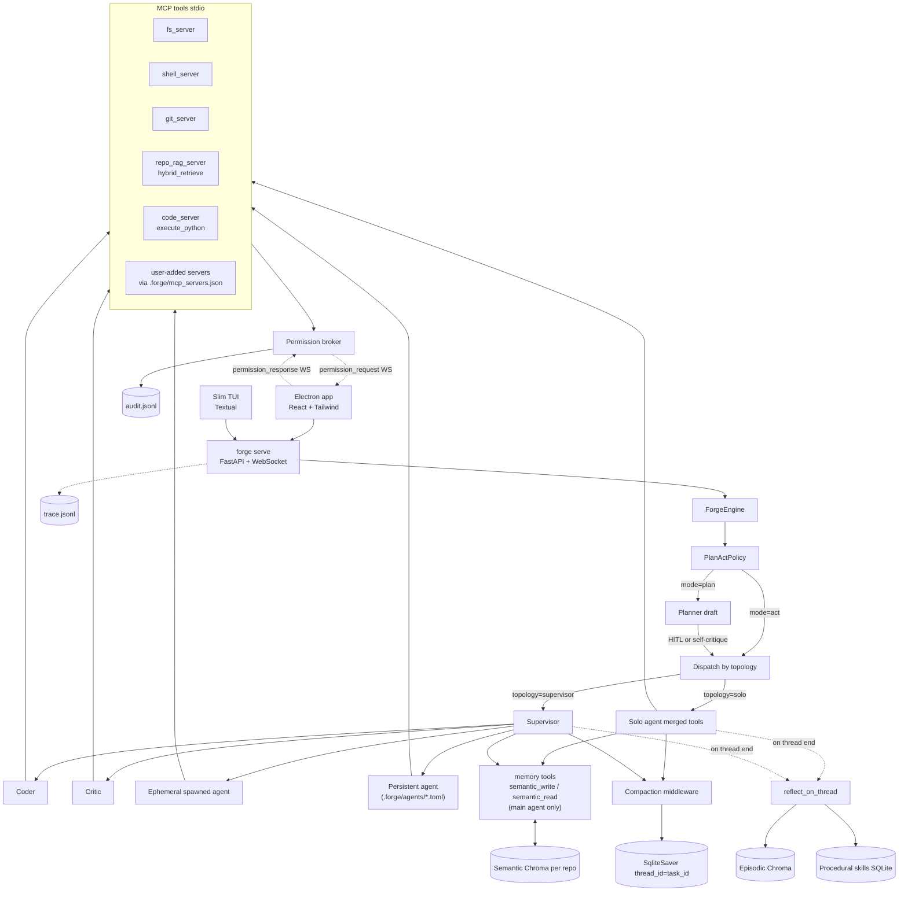

# Forge

A small, opinionated coding agent built backwards from an eval harness. Forge is the capstone of the three-week curriculum: it reuses the winning patterns from Weeks 1–3 (compaction, supervisor topology, 3-tier memory, hybrid RAG, MCP plumbing) and ships them as a single tool you can run in any repo.

The point of Forge is not to be the fastest coding agent on the planet. The point is to be **a coding agent you can fully see through** — every tool call is gated, every memory write is logged, every routing decision is traced — so you can teach (and debug) why it makes the choices it makes.

```
$ forge init                      # creates .forge/ next to your .git
$ forge index                     # builds the per-repo hybrid RAG index
$ forge serve                     # headless FastAPI+WS backend (Electron + slim TUI)
$ forge                           # slim chat TUI (the SSH-friendly fallback)
$ forge eval                      # runs the bundled regression gold set
```

The **primary** UI is the Electron app under `apps/forge/electron/`. Launch
it with `cd apps/forge/electron && npm install && npm run dev`; it spawns
`forge serve` for you if there isn't one running and connects over loopback.
The TUI is a deliberate minimum (chat + status strip + permission/plan
modals only) so you can still use Forge over SSH.

## Why Forge exists

Each of the three weeks of the course pinned down one piece of the puzzle:

- **W1** — *what is a good answer?* (rubric judges, hybrid retrieval, evidence-grounded refusal)
- **W2** — *how do agents collaborate?* (solo vs supervisor; iterative compaction with a strong summarizer; MCP vs programmatic; 3-tier memory)
- **W3** — *how do we know the judge isn't lying?* (DSPy-optimized rubric, memory-aware benchmarks)

Forge is what you get when you commit to those answers in a single product. It does not invent a new pattern. It picks the *winning* pattern at each layer and exposes the trade-off in `.forge/config.toml`.

## Locked design decisions

These are not negotiable — they are derived directly from prior weeks' bake-offs.

- **Topology is task-dependent.** W2 N0 found solo wins on simple tasks, supervisor wins on hard ones. Forge ships **both** and the plan/act layer routes per task. No global "winner".
- **MCP, deliberately.** W2 N1 found *direct programmatic* tool wiring beats MCP on raw success rate. Forge uses MCP anyway — for process isolation, a stable permission boundary, and a transparent on-the-wire surface. We document this as a **teaching trade-off**, not an oversight.
- **Compaction = iterative refinement + strong summarizer.** W2 S4 didn't crown a single strategy, but its strongest finding was "the summarizer model dominates rule preservation." Forge defaults to the `refine` middleware paired with `anthropic/claude-opus-4.7` as the summarizer. Both swappable in config.
- **Memory belongs to the main chat agent only (MVP).** Ephemeral and persistent agents do not get their own stores yet. Reflection runs on the main transcript at thread close.
- **The eval harness is small in the binary.** `forge eval` is a thin gold-set runner. Statistical analysis (McNemar, Wilson CIs, pairwise comparisons) lives in `notebooks/plan_act_bakeoff.ipynb`. Forge optimizes for *working*, not for benchmarking itself.

## Architecture



### Three agent classes

| class | spawned by | context window | memory store | configured in |
|---|---|---|---|---|
| **Main chat agent** | the user (the TUI or the Electron Chat tab) | persistent across the thread | semantic + episodic + procedural (per-repo) | `.forge/config.toml` |
| **Ephemeral spawned agent** | the supervisor (the `spawn` tool) | fresh; collapses on completion | none | inline in the spawn call |
| **Persistent agent** | the supervisor (a generated `delegate_to_<name>` tool) | per-delegation fresh thread | none (deferred) | `.forge/agents/<name>.toml` |

### Where state lives

Everything Forge writes lives under `<repo>/.forge/`:

```
.forge/
  config.toml                # the single source of truth
  agents/<name>.toml         # persistent agent specs
  memory/
    semantic_chroma/         # SemanticMemory store (per-repo)
    episodic_chroma/         # EpisodicMemory store (per-repo)
    procedural.sqlite        # ProceduralMemory store (per-repo)
  rag_index/                 # bm25 + dense + meta from `forge index`
  checkpoints.sqlite         # LangGraph async sqlite saver
  audit.jsonl                # every permission decision
  trace.jsonl                # every agent / tool / memory event
  eval_results/              # CSVs from `forge eval`
```

Per-repo by design. **Memory is not shared across repos.** If you want a shared "researcher knows everything" notebook, that's a persistent-agents-with-memory feature on the roadmap — not the current MVP.

## Plan / Act policy

Forge ships **two** `PlanActPolicy` implementations. Every policy returns a
`Decision(mode, topology, ...)` that drives both whether to draft+approve a
plan first and which topology executes:

| policy | mode | topology | cost / risk |
|---|---|---|---|
| `trajectory_probe` (default) | LLM-decided | LLM-decided | one cheap structured-output LLM call per task; operationalizes W2 N0 |
| `tool_risk_heuristic` | regex on the task text | regex on the task text | **zero LLM cost**; tied the strongest LLM policy on the W3 bake-off at 89.2% oracle pass-rate |

Pick `tool_risk_heuristic` when you don't want to pay for routing on every
turn (e.g. high-throughput agent loops). Pick `trajectory_probe` when you
want the routing call to see context. Configure via:

```toml
[plan_act]
policy = "trajectory_probe"   # or "tool_risk_heuristic"
```

The bake-off in `notebooks/plan_act_bakeoff.ipynb` compares both
against three ablation baselines (`always_act_solo`, `always_plan_super`,
`plan_then_self_critique`) on the same gold set Forge regresses against.
Those ablations live in `notebooks/plan_act_alts.py` and are **not**
part of the Forge package — that's the whole point of keeping the bake-off
separate from the product.

To run a custom policy in Forge without registering it as a named one:

```python
from forge.agent.engine import ForgeEngine
from my_policy import MyPolicy
engine = await ForgeEngine.start(paths=..., cfg=...)
result = await engine.run_task("…", policy=MyPolicy())
```

Any object satisfying the `forge.agent.plan_act.PlanActPolicy` protocol works. If a custom policy ever beats `trajectory_probe` in the bake-off, lift it into `forge/agent/plan_act/` and add it to the `PlanActPolicyName` literal in `forge/config.py` to make it a named choice.

## Comparison vs other coding agents

Kept intentionally honest. Hermes stays in the table because Nous Research's [hermes-agent](https://github.com/NousResearch/hermes-agent) (Feb 2026, MIT, CLI + TUI, MCP-native, parallel sub-agents, persistent skills) is the closest spiritual neighbor to Forge in the OSS ecosystem.

| Dimension | Forge | Claude Code | opencode | aider | Cline | Hermes |
|---|---|---|---|---|---|---|
| Surface | Electron (+ slim TUI) | TUI | TUI | CLI REPL | VS Code ext. | TUI + CLI + gateways |
| Provider-agnostic | yes (OpenRouter + local Ollama) | Anthropic only | yes | yes | yes | yes |
| MCP support | yes, native | yes, native | yes | no | yes | yes, native |
| Sub-agents / topology | supervisor + workers + persistent | subagents | "agents" | single loop | plan→act, single | parallel subagents |
| Memory tiers | semantic + episodic + procedural | session + project files | session + AGENTS.md | repo map | session | persistent memory + skill library |
| Checkpointing | LangGraph SqliteSaver | partial | partial | no | no | session resume; node-level unclear |
| Compaction | explicit (refine + Opus summarizer) | `/compact` | auto | no | partial | yes |
| Permission model | per-tool gates + JSONL audit | per-tool prompts | per-tool prompts | git-diff confirm | act-mode prompts | per-tool prompts |
| Built-in eval harness | yes (Forge regression suite) | no | no | no | no | no |
| Open source | yes | partly | yes | yes | yes | yes (MIT) |

The defensible row is **Built-in eval harness**: Forge ships with `forge eval` and the bake-off notebook against the same gold set. The interesting comparison row vs Hermes is **Memory tiers** — Hermes merges "skills library + persistent memory" into one user-facing concept; Forge keeps the W2/W3 split (semantic / episodic / procedural) intact because that split is the teaching artifact.

## Teaching note: why MCP if programmatic wins?

The W2 N1 bake-off found `via_programmatic` beat `via_mcp` on success rate. Forge ships MCP anyway. Three reasons, in order of importance:

1. **Per-tool, per-agent permission gating at a stable boundary.** Wrapping a Python function with a permission check is easy; wrapping it again when the function moves, gets renamed, or grows a new argument is the problem. MCP gives us a permission gate keyed off `(tool_name, args)` that does not break when the implementation moves.
2. **Process isolation.** The `fs`, `shell`, `git`, and `repo_rag` servers are subprocesses. A crash, a bad regex, an OOM in one server doesn't take the TUI with it.
3. **Transparency.** Every tool call goes over a wire we can tee into `trace.jsonl` and into the Electron Agents tab's live graph. With programmatic wiring, the same observability is doable but bespoke.

The cost is real: a small constant latency per call plus a slightly higher success-rate variance from the JSON-RPC layer. We pay that cost knowingly. For a benchmark you'd pick programmatic; for a teaching agent you'd pick MCP.

## Quickstart

### Install

```bash
cd apps/forge
pip install -e .
```

Forge depends on the course's `src/` modules (`shared`, `memory`, `middleware`, `multi_agent`). The package auto-discovers them at import time — no extra path setup needed.

### Model providers

Forge resolves model slugs through `shared.get_llm` which dispatches on prefix:

- **OpenRouter** (default for everything in `MODEL_REGISTRY`): slugs of the
  form `openai/…`, `anthropic/…`, `google/…`, `qwen/…`, `meta-llama/…`,
  etc. Requires `OPENROUTER_API_KEY` in your env.
- **Ollama** (local, $0): any slug starting with `ollama/…`
  (e.g. `ollama/llama3.2`, `ollama/qwen2.5-coder`). Talks to `OLLAMA_HOST`
  (default `http://localhost:11434`). No API key required.

```toml
[models]
default_agent    = "ollama/llama3.2"        # cheap local
trajectory_probe = "openai/gpt-5.4-nano"    # but route with a frontier
judge            = "anthropic/claude-opus-4.7"
```

Use `GET /api/models/health?slug=...` (or the **verify** button in the
Electron Settings tab) to confirm a slug actually resolves before you save.

### Initialize a repo

```bash
cd /path/to/your/repo
forge init                # writes .forge/config.toml with sane defaults
forge index               # builds the hybrid RAG index over your repo
```

`forge index` will download a sentence-transformers model on first run (`all-MiniLM-L6-v2`, ~80MB). Subsequent indexes are incremental.

### Run the desktop app (primary)

```bash
forge serve &                                  # one process, loopback only
cd apps/forge/electron
npm install
npm run dev                                    # electron-vite dev + HMR
```

Five tabs in the left rail: **Chat**, **Agents**, **Memory**, **MCP**,
**Settings**. The Chat tab opens a single bidirectional WebSocket to
`/ws/chat`; tool calls / agent spawns / plan approvals / permission asks
all stream over that one socket.

### Run the slim TUI (companion)

```bash
forge
```

Chat only. Side panels intentionally absent — use the Electron app for
audit / agents / memory / settings. Slash commands:

- `/plan <task>` — force plan mode
- `/act <task>`  — force act mode (skip deliberation)
- `/done`        — close the thread; runs end-of-thread reflection
- `/help`        — list commands
- `/quit`        — exit

### Configure

```bash
forge config              # print resolved config
$EDITOR .forge/config.toml
```

Or use the Electron settings form (`forge serve` + `npm run start` in `apps/forge/electron/`) — it generates a typed form from the same Pydantic schema.

### Run the regression suite

```bash
forge eval                # ~20 tasks, prints pass/fail + success rate
forge eval --limit 5      # smoke run
```

Exit code is `0` if pass-rate ≥ 80%, `1` otherwise. CSV side-effect lands in `.forge/eval_results/`.

### Watch the audit log

```bash
forge audit --tail 100
```

Every permission decision the broker made (`allow` / `ask`+answer / `deny`) is appended one-line-JSON to `.forge/audit.jsonl`. Replay-friendly.

## Persistent agents — quickstart

Persistent agents are named, user-configured workers the **supervisor** can delegate to. They have their own system prompt and a narrowed tool allowlist. They do **not** have their own memory store yet (deferred per the locked decisions).

### Create one

```bash
mkdir -p .forge/agents
$EDITOR .forge/agents/researcher.toml
```

```toml
name = "researcher"
description = "Search the repo and the web for context. Read-only."
model = "openai/gpt-5.4-nano"
system_prompt = """
You are the researcher specialist. Your job is to gather context to inform a downstream coder.
You have no write tools. Cite file paths with line ranges in your final summary.
"""
tools = ["fs_read", "fs_list", "repo_rag_hybrid_retrieve", "git_diff"]
```

That's it. On the next `forge` launch the supervisor will be given a `delegate_to_researcher` tool. There is **no** user-facing `/researcher` slash command — that's intentional. The supervisor decides when to dispatch.

### Permission rules for persistent agents

- **Deny-by-default.** A persistent agent can only call tools its `.toml` lists explicitly. Anything else is denied at the broker layer, regardless of the global `[permissions.tools]` defaults.
- **Allowlists are additive, not subtractive.** Listing `fs_write` in your persistent agent grants it the right to *ask*; the global `[permissions]` policy still decides whether to allow / ask / deny.
- **One broken toml does not kill the TUI.** Invalid agent files get a warning on stderr and are skipped.

### Manage from the Electron app

The Electron Agents tab is a list-and-form for the same `.forge/agents/*.toml` files. The form validates against `PersistentAgentSpec` (Pydantic) and writes atomically through `PUT /api/agents/<name>`.

## Configuration reference

Single source of truth: `<repo>/.forge/config.toml`. Default contents (annotated):

```toml
[models]
default_agent       = "openai/gpt-5.4-nano"           # solo + workers fallback
planner             = "openai/gpt-5.4-nano"
coder               = "openai/gpt-5.4-nano"
critic              = "openai/gpt-5.4-nano"
supervisor_router   = "openai/gpt-5.4-nano"
summarizer          = "anthropic/claude-opus-4.7"     # operationalizes W2 S4 finding
trajectory_probe    = "openai/gpt-5.4-nano"
judge               = "anthropic/claude-opus-4.7"

[compaction]
strategy            = "refine"        # refine | rules_first | map_reduce | lc_sliding_window | recursive | hierarchical | none
trigger_kind        = "tokens"        # tokens | messages
trigger_threshold   = 32000           # raw int. For "tokens" pair with a model whose window > this.
keep_last           = 6
summary_max_tokens  = 1500

[plan_act]
policy                  = "trajectory_probe"          # or "tool_risk_heuristic"
hitl_auto_approve       = false                       # set true for headless / eval

[memory]
enabled                 = true
semantic_k              = 5
episodic_k              = 3
skill_inject_count      = 3
reflect_on_thread_end   = true
semantic_thread_start_k = 3                            # how many memories to seed on turn 1

[repo_rag]
bm25_k              = 20
dense_k             = 20
rrf_k               = 60                              # standard RRF constant
rerank_top_k        = 5
chunk_size          = 800
chunk_overlap       = 120
embedding_model     = "sentence-transformers/all-MiniLM-L6-v2"
index_excludes      = ["node_modules", "dist", ".venv", ".git", ".forge", "**/*.lock", "**/*.min.js"]

[permissions]
default             = "ask"
shell_allowlist     = ["ls", "cat", "rg", "git status", "git diff", "pytest"]
[permissions.tools]                                   # per-tool overrides
fs_read                  = "allow"
fs_list                  = "allow"
repo_rag_hybrid_retrieve = "allow"
git_status               = "allow"
git_diff                 = "allow"
git_log                  = "allow"
git_branch               = "allow"
shell_allowlist          = "allow"
fs_write                 = "ask"
fs_edit                  = "ask"
fs_mkdir                 = "ask"
git_add                  = "ask"
git_commit               = "ask"
git_reset                = "ask"
git_push                 = "deny"
code_execute_python      = "ask"      # arbitrary Python in the code server
code_reset_namespace     = "allow"

[checkpoint]
db_path             = ".forge/checkpoints.sqlite"
resume_on_launch    = true

[trace]
enabled             = true
path                = ".forge/trace.jsonl"

[ui]
theme               = "dark"
server_port         = 6790
show_audit_panel    = true
```

**Hot-reload rule:** changes apply to the *next* thread. In-flight threads keep their original config (avoid mid-flight model swaps). The Electron settings form badges "restart needed" on fields the Pydantic schema marks `live=False`.

## Risk callouts

- **Repo-RAG cold start.** First `forge index` on a real repo can take 1-5 minutes (sentence-transformers loads). Subsequent indexes are incremental. Tune `index_excludes` to skip generated code.
- **Shell tool blast radius.** `shell_server.exec` defaults to `ask` for commands outside `shell_allowlist`. Never auto-runs `rm -rf`, `git push`, `curl | sh`-style patterns even when an `allow` rule matches a prefix.
- **Local server attack surface.** `forge serve` binds `127.0.0.1` only, no auth (single-user dev box assumption). The CLI refuses non-loopback `--host` bindings at the flag layer.
- **Per-repo memory partitioning.** Chroma collections are keyed off the repo path. Memory does not cross-pollinate between repos. Per-persistent-agent memory partitions are deferred.
- **Topology mis-routing.** If `trajectory_probe` routes too aggressively to `supervisor`, costs balloon; too aggressively to `solo`, hard tasks fail. The bake-off notebook's bucket-by-policy heatmap is the artifact you use to tune the policy before shipping.
- **Persistent agent escape.** A misconfigured persistent agent that lists `fs_write` + `shell_exec` could exfiltrate. The broker still gates each call — but you're responsible for what's in `.toml`. Treat persistent-agent files like git-committed code; review them.

## Repo layout

```
apps/forge/
  README.md                              <- you are here
  pyproject.toml
  forge/
    cli.py                               # `forge`, `forge serve`, `forge eval`, ...
    config.py                            # ForgeConfig pydantic model + TOML loader
    paths.py                             # per-repo path resolution
    trace.py                             # JSONL event tracer
    agent/
      engine.py                          # top-level ForgeEngine
      solo.py                            # build_forge_solo
      supervisor.py                      # build_forge_supervisor
      workers.py                         # planner / coder / critic WorkerSpec
      agents_registry.py                 # .forge/agents/*.toml -> WorkerSpec
      spawn.py                           # ephemeral sub-agent spawning
      compaction.py                      # refine middleware + summarizer
      permissions.py                     # PermissionBroker + audit
      prompts.py
      plan_act/
        base.py                          # PlanActPolicy + Decision + ForgeContext
        trajectory_probe.py              # default — one structured-output LLM call
        tool_risk_heuristic.py           # regex-only — zero LLM cost
    mcp/
      tool_loader.py                     # MCP servers -> LangChain tools w/ broker
      repo_rag_indexer.py                # build_index / load_index
      manifest.py                        # user-added MCP servers manifest
    mcp_install.py                       # /api/mcp/validate + /api/mcp/install logic
    memory/
      tools.py                           # semantic_write / semantic_read
      reflect.py                         # end-of-thread reflection wrapper
    tui/
      app.py                             # slim chat TUI (chat + status strip + modals)
      styles.tcss
    eval/
      runner.py                          # gold-set runner
      judge.py                           # judge_with_rubric wrapper
      golds/forge_tasks.jsonl            # ~20 regression tasks
    server.py                            # FastAPI + /ws + /ws/chat backend
  mcp_servers/
    fs_server.py                         # FastMCP read/list/write/edit/mkdir
    shell_server.py                      # FastMCP exec (allowlist gated)
    git_server.py                        # FastMCP status/diff/log/branch/add/commit/reset/push
    repo_rag_server.py                   # FastMCP hybrid_retrieve
    code_server.py                       # FastMCP execute_python (W2 NB1 winner)
  electron/
    package.json                         # electron-vite + React + TS + Tailwind
    electron.vite.config.ts
    src/
      main/index.ts                      # finds repo, spawns `forge serve`
      preload/index.ts
      renderer/...                       # React app (Chat / Agents / Memory / MCP / Settings)
  docs/
    turn-flow-walkthrough.md             # how a user turn flows through Forge
notebooks/
  plan_act_bakeoff.ipynb                 # paired McNemar across 5 policies
  plan_act_alts.py                       # the 4 ablation policies (NOT in Forge)
```

## Roadmap (things deliberately deferred)

- Per-persistent-agent memory partitions (semantic + episodic scoped to one persistent agent).
- `forge eval --watch` daemon for CI regression on every commit.
- Multi-channel gateways (Slack/Discord) feeding the same backend.
- `forge sweep` + statistical machinery in the binary (currently the notebook's job).
- `electron-forge` packaged distribution.

Forge is small on purpose. Adding to this list should require a corresponding bake-off in `notebooks/` showing the new thing earns its keep.
